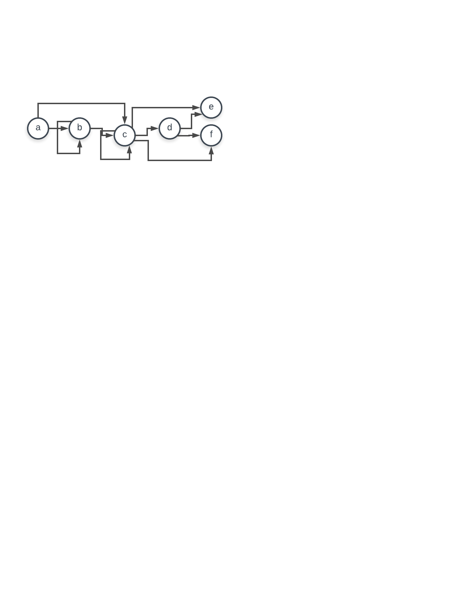
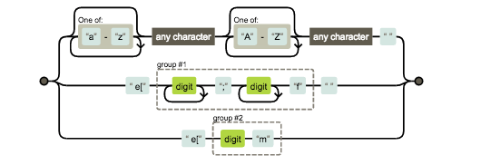

### Theory

####  catches antelope and antelopes

\b(antelope)s? (rock)s? out\b[ig]

####  moat, goat, no boat
\b[gm]oat\b[igm]

####  dates
\b(\d{1,4})\-(\d{1,2})\-(\d{1,2})*\s


####  State Machines 
Lion state machine attached 

ABC state machine attached



####  VT100
//ESC[12;45f

/\e\[(\d+\;\d+f)/g 

// ESC[1m

/\e\[(\dm)/g 

state machine attached



###Algorithms

#### Analysis of Algorthms
##### Exercise I
    a) O(n)
    b) O(log n)
    c) O(log n)
    d) O(n log n)
    e) O(n!)
    f) O(n)
    g) O(n)

##### Exercise II

a)
``` 
best = 0.0;
min = a[0];
for (int i = 0; i < N; i++) 
{
    min = Math.min(a[i], min);
    best = Math.max(a[i] - min, best);
}
```

b) Egg strategy

  * Get a bunch of eggs. A _bunch_.
  * I'd start at the middle floor (f/2) and drop an egg, see what happens. If it doesn't break, I know I can go to a higher floor. If it does break, I know I need to go lower.
  * If I needed to go higher I'd determine how many floors are above me and split that in half and move to the middle floor (h/2).
  * If I need to go lower, I do the same thing. I go to the floor halfway between me and the ground (l/2).
  * Continue like this until I determine which floor I can successfully throw an egg from without breaking it. 
  * If someone asks me to write a function that figures this out, I will pelt them with my remaining eggs.


##### Exercise III


